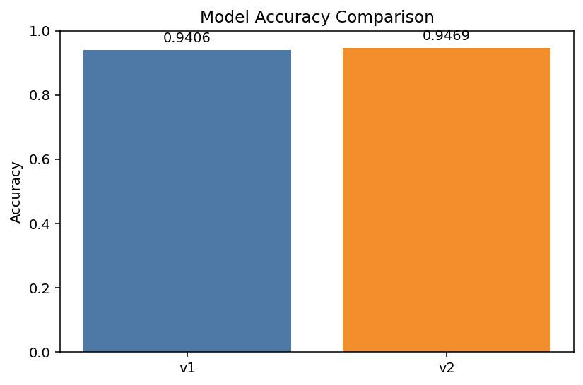
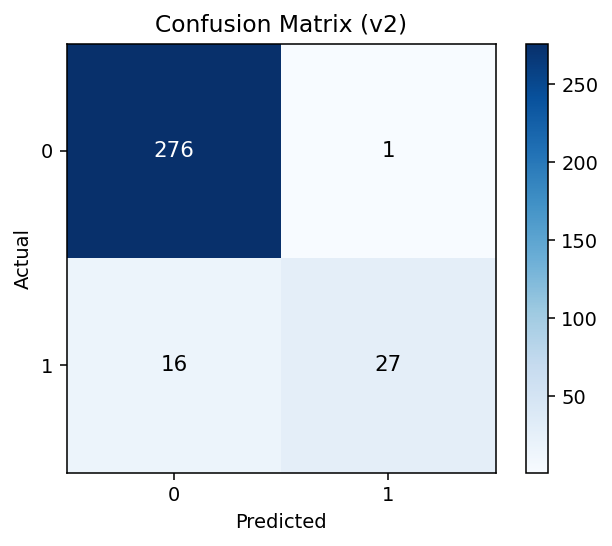

# VelvetVine

VelvetVine is a small ML demo project with:

- `src/preprocess.py` to clean/prepare `data/dataset.csv`
- `src/train.py` to train a simple model and write artifacts into `models/`
- `api/main.py` to serve predictions via a FastAPI app and append requests to `logs/predictions.csv`

## 1) Setup

```powershell
python -m venv .venv
.\.venv\Scripts\Activate.ps1
pip install -r requirements.txt
```

## 2) Train

```powershell
python -m src.train
```

Artifacts are written to:

- `models/model_v1.pkl`
- `models/scaler_v1.pkl`
- `models/model_info_v1.json`

## 2b) Retrain (new version)

Add new labeled rows (same columns as the wine dataset, including `quality`) into:

- `data/new_wine_data.csv` (optional)

Then run:

```powershell
python -m src.retrain
```

This auto-creates the next version (e.g. `model_v2.pkl`, `scaler_v2.pkl`, `model_info_v2.json`).

## 3) Run API

```powershell
uvicorn api.main:app --reload
```

By default the API loads the latest `models/model_v*.pkl`. To pin/rollback:

```powershell
$env:TERRAFLOW_MODEL_VERSION="v1"
uvicorn api.main:app --reload
```

Open:

- `http://127.0.0.1:8000/health`
- `http://127.0.0.1:8000/docs`
- `http://127.0.0.1:8000/model`

## 4) Generate Model Accuracy and Confusion Matrix Charts

```powershell
python -m src.evaluate
```

This generates:

- `web/assets/model_accuracy_comparison.png`
- `web/assets/confusion_matrix_v1.png`
- `web/assets/confusion_matrix_v2.png`

### Model Accuracy Comparison



### Confusion Matrix (v1)


### Confusion Matrix (v2)



## Notes

- If you haven’t trained yet, the API will return an error on `/predict` until the model artifacts exist.
